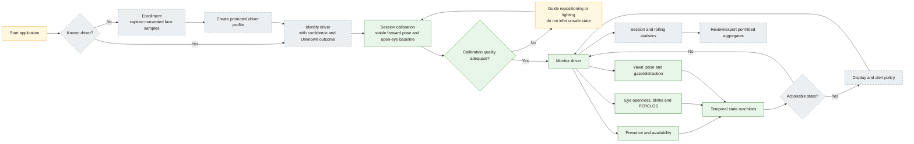
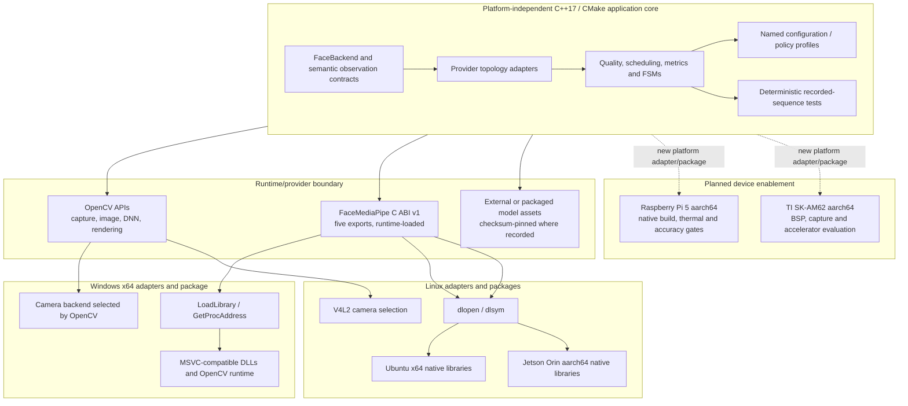

# DMS Next architecture

Status date: 2026-09-03  
Scope: current Stage 20 engineering checkpoint and approved follow-on direction

This document gives four coordinated views of the same system. It separates
what is running today from reusable core capability and planned product work so
that an architecture diagram is not mistaken for a release claim.

## Status legend

- **Implemented** — present in the repository and covered by tests or recorded
  validation.
- **Integrated** — reachable in the current application or benchmark path.
- **Planned** — architectural direction only; it must pass its own privacy,
  accuracy, resource, and product gates before release.
- **External** — supplied or retained outside the source repository.

## View 1 — user workflow



The implemented core calibrates an open-eye baseline and a neutral head pose,
tracks quality, presence, eye state, blink/long-blink/prolonged closure,
PERCLOS, yawns, head movement, distraction, monitoring availability, and
drowsiness. The current camera executable integrates only face detection,
semantic eye mapping, geometric EAR/blink tracking, a face rectangle, and a
text overlay. Enrollment, biometric profile storage, recognition, alert
delivery, configurable display selection, recording, and user-facing
statistics remain planned.

User and privacy rules for the planned workflow:

1. Enrollment is explicit and consented; failure to match must produce
   **Unknown**, never an automatic identity assignment.
2. Calibration accepts only stable, usable observations. Missing, occluded,
   stale, low-confidence, or recovering input is not interpreted as closed
   eyes, absence, or fatigue.
3. A driver change or sufficiently long absence ends the current calibration
   and statistics scope and requires re-identification/recalibration.
4. Alerts come from debounced temporal state, not a single model frame.
5. Biometric templates, raw media, and identity-bearing events require a
   separate retention, encryption, access-control, deletion, and audit policy.

## View 2 — developer and runtime architecture

```mermaid
flowchart LR
    subgraph Input[Capture and time]
        CAM[Camera / video / still]
        CAP[Capture adapter<br/>OpenCV VideoCapture]
        CLK[Monotonic source-frame clock]
        SLOT[Depth-one latest-frame slot]
        CAM --> CAP --> CLK --> SLOT
    end

    subgraph Providers[Provider and model boundary]
        SCH[Independent cadence scheduler]
        YL[YuNet detector + LBF landmarks]
        YP[YuNet detector + PFLD landmarks]
        MP[MediaPipe Face Landmarker<br/>runtime-loaded C ABI]
        ER[Eye ROI quality / refinement]
        REC[Recognition provider]
        OBJ[Object/context provider]
        SCH --> YL
        SCH --> YP
        SCH --> MP
        SCH --> ER
        SCH --> REC
        SCH --> OBJ
    end

    subgraph Semantics[Platform- and provider-neutral semantics]
        MAP[Topology-specific adapters]
        OBS[Timestamped semantic observations<br/>validity, confidence, visibility, age]
        QUAL[Quality and freshness gates]
        MET[Metrics<br/>openness, EAR, PERCLOS, mouth, pose, gaze]
        MAP --> OBS --> QUAL --> MET
    end

    subgraph Decisions[Deterministic temporal logic]
        EYE[Eye / blink / closure FSM]
        YAWN[Yawn FSM]
        POSE[Head movement FSM]
        GAZE[Distraction FSM]
        PRES[Presence and availability FSMs]
        DROW[Drowsiness FSM]
        MET --> EYE
        MET --> YAWN
        MET --> POSE
        MET --> GAZE
        QUAL --> PRES
        EYE --> DROW
        YAWN --> DROW
        PRES --> DROW
    end

    subgraph Output[Presentation and evidence]
        SNAP[Latest non-stale state snapshot]
        UI[Display / area-of-interest overlay]
        ALERT[Alert policy and actuator adapter]
        LOG[Structured event and statistics recorder]
        SNAP --> UI
        SNAP --> ALERT
        SNAP --> LOG
    end

    SLOT --> SCH
    YL --> MAP
    YP --> MAP
    MP --> MAP
    ER --> OBS
    REC --> OBS
    OBJ --> OBS
    EYE --> SNAP
    YAWN --> SNAP
    POSE --> SNAP
    GAZE --> SNAP
    PRES --> SNAP
    DROW --> SNAP
```



Runtime invariants:

1. Source-frame monotonic timestamps determine event time. UI, capture delay,
   worker scheduling, and inference duration do not.
2. Slow workers consume a bounded latest-frame slot and may skip superseded
   frames; they cannot create an unbounded latency queue.
3. Eye, geometry, recognition, and object work have independent configurable
   cadences and maximum observation ages.
4. Provider-specific landmark indices end at topology adapters. Downstream
   algorithms consume named semantic contours, points, confidences, validity,
   visibility, and timestamps.
5. Quality loss is explicit. Reacquisition passes through a recovering state so
   an occlusion boundary cannot become a blink, yawn, pose, gaze, or drowsiness
   event.
6. MediaPipe SDK types and headers do not enter the application interface. The
   application loads a five-function C ABI, version 1, from
   `FaceMediaPipe.dll` or `libFaceMediaPipe.so` at runtime.
7. Rendering and recording consume state snapshots; they do not own detection
   thresholds or temporal state.

Current integration map:

| Block | Repository implementation | Status |
| --- | --- | --- |
| Capture and camera UI | `src/main.cpp` using OpenCV `VideoCapture`, `imshow`, and `waitKey` | Integrated |
| Provider contract | `include/FaceBackend.hpp` | Integrated |
| YuNet + LBF | `YuNetLbfBackend`, `FaceDetector`, `LbfLandmarkDetector` | Integrated; default camera backend |
| YuNet + PFLD | `YuNetPfldBackend`, `PfldLandmarkProvider` | Implemented benchmark candidate; external model required |
| MediaPipe | `MediaPipeBackend`, `FaceMediaPipeRuntime`, versioned C bridge | Integrated when explicitly enabled and packaged |
| Semantic adapters | eye, face geometry, gaze, head-pose and eye-quality adapters | Implemented; benchmark path is broader than camera UI |
| Observation and scheduling core | `DmsObservation`, `DmsScheduler`, `LatestFrameSlot` | Implemented and cross-platform tested |
| Metrics and FSMs | `DmsEyeMetrics`, `DmsTemporalEvents`, `DmsPolicy` | Implemented and recorded-sequence tested |
| Display | face box plus blink/EAR state in `src/main.cpp` | Integrated subset |
| Structured benchmark evidence | `face_benchmark`, schema 4 traces and JSON aggregates | Integrated for development evaluation |
| Recognition, object providers, product alert delivery, event recorder | interfaces/architecture only | Planned |

## View 3 — portability boundary

Platform independence starts at the semantic observation contract for DMS
algorithms. A second, narrower binary-portability seam exists at the MediaPipe C
ABI: the C++ application remains independent of MediaPipe SDK headers, although
each bridge binary and its transitive runtime still must be built and packaged
for its target operating system and architecture.



| Layer | Portable source? | Target-specific responsibility |
| --- | --- | --- |
| Semantic observations, quality rules, scheduler, metrics, FSMs, named policy | Yes | Compile and test with a conforming C++17 toolchain |
| Provider adapters | Mostly | Model asset, supported inference backend, and performance vary by target |
| MediaPipe application boundary | Yes | Build a native bridge and all transitive dependencies for each OS/architecture |
| Dynamic loading | Public C++ wrapper is portable | `LoadLibrary`/`GetProcAddress` on Windows; `dlopen`/`dlsym` on Linux |
| Camera capture | Call site is mostly shared | Current Windows default backend versus explicit V4L2 on Linux; device format and controls differ |
| Rendering | OpenCV API is shared | Windowing backend, display availability, and headless operation differ |
| Packaging | Script contract is parallel | Native DLL/SO selection, dependency discovery, launch script, architecture, and checksums |
| Acceleration | Interface direction is portable | XNNPACK/CPU today; TensorRT/CUDA, DirectML, Hailo, or TI acceleration require separate proof |

Validated platform claims are deliberately narrow:

- Windows x64: application, YuNet/LBF, optional packaged MediaPipe, and Stage 20
  core/test paths have recorded validation.
- Ubuntu x64: CMake application and applicable OpenCV/provider/core tests have
  recorded validation; no Ubuntu x64 MediaPipe runtime package is claimed.
- NVIDIA Jetson Orin/Linux aarch64: application, YuNet/LBF, optional packaged
  MediaPipe, and Stage 20 core/test paths have recorded validation. MediaPipe is
  CPU-bound and is not a viable every-frame production path at the tested
  640x480 configuration.
- Raspberry Pi 5 and TI SK-AM62: planned only. Support must not be claimed until
  native build, package, camera, sustained resource/thermal, and accuracy gates
  pass on the actual device.

## View 4 — technology and distribution inventory

This is an engineering inventory, not legal advice. “Recorded” means the
repository contains an exact pin or checksum. “Build-resolved” means the build
currently accepts a compatible installed dependency but does not enforce one
exact version. Before any external distribution, generate the package manifest,
inventory transitive dependencies, collect their exact notices, and obtain the
project's release/legal approval.

| Component | Role | Version / revision | License status | Authoritative source | Pin / SHA-256 | Supported or evaluated platform | Distribution obligation / release gate |
| --- | --- | --- | --- | --- | --- | --- | --- |
| DMS Next application source | Capture orchestration, semantic adapters, scheduling, metrics, FSMs, UI and tooling | Package records Git source revision; no product release tag yet | **Not declared in this repository** | This repository | Git revision in package manifest | Windows x64; Ubuntu x64; Orin aarch64 | Do not distribute source or claim a product license until the owner adds an explicit license and release approval. |
| C++ language/runtime | Portable application and core | C++17 required | Toolchain/runtime terms vary | ISO C++ plus selected compiler vendor | `CMAKE_CXX_STANDARD=17`; compiler not pinned | All current targets | Record compiler and redistributable runtime; comply with MSVC/GCC runtime terms used by the package. |
| CMake | Application build and test registration | Minimum 3.10; exact build version not pinned | BSD 3-Clause | [Kitware CMake](https://github.com/Kitware/CMake) | Build-resolved | Windows and Linux hosts | Preserve applicable copyright/license notice when redistributing CMake itself; normally a build tool, not application payload. Record exact build version. |
| OpenCV + contrib | Camera capture, image operations, DNN inference, face/LBF APIs and display | 4.8.0 is the documented and validated baseline; `find_package` does not enforce it | Apache-2.0 for OpenCV 4.5.0+; bundled third-party components may add notices | [opencv/opencv 4.8.0](https://github.com/opencv/opencv/tree/4.8.0), [opencv_contrib 4.8.0](https://github.com/opencv/opencv_contrib/tree/4.8.0) | Version baseline; DLL/SO hashes generated per package | Windows x64; Ubuntu x64; Orin aarch64 | Include Apache-2.0 license/NOTICE and the exact build's third-party notices; record build options and all shipped shared libraries. Review codec/video-I/O dependencies separately. |
| YuNet face detector model | Primary face detector for YuNet/LBF and YuNet/PFLD | Artifact named `face_detection_yunet_2026may.onnx`; upstream revision not recorded | **Unverified for this exact artifact** | Committed artifact; original upstream source must be reconstructed before release | `ebafce4e3c118d6554634be5c27ab333b4c047a9a8c3faf1d7cf93101c22f0f0` | Windows x64; Ubuntu x64; Orin aarch64 | Block external distribution until exact upstream URL/revision, model license, training-data terms, and required attribution are recorded. Filename alone is not provenance. |
| OpenCV LBF landmark model | 68-point facial landmark baseline | Artifact named `lbfmodel.yaml`; upstream revision not recorded | **Unverified for this exact artifact** | Committed artifact; original upstream source must be reconstructed before release | `70dd8b1657c42d1595d6bd13d97d932877b3bed54a95d3c4733a0f740d1fd66b` | Windows x64; Ubuntu x64; Orin aarch64 | Block external distribution until exact model provenance, license, training-data terms, and attribution are recorded. |
| MediaPipe | Optional face-landmark provider behind bridge | v0.10.33; commit `3987048d4b390aa9ae675c796f6421bbeece6511` | Apache-2.0; transitive dependencies have their own terms | [google-ai-edge/mediapipe](https://github.com/google-ai-edge/mediapipe/tree/3987048d4b390aa9ae675c796f6421bbeece6511) | Exact tag and commit in `mediapipe/MEDIAPIPE_VERSION` | Packaged/validated on Windows x64 and Orin aarch64 | Include Apache-2.0 license/NOTICE and all transitive notices; package only the verified target-native bridge and dependencies. Re-run dependency/license inventory after applying repository build patches. |
| MediaPipe Face Landmarker task model | MediaPipe face detector/landmarker runtime asset | Repository-pinned task bundle | **License/provenance not recorded beside the artifact** | Committed artifact; exact download URL/revision must be recorded before release | `64184e229b263107bc2b804c6625db1341ff2bb731874b0bcc2fe6544e0bc9ff` | Windows x64; Orin aarch64 package | Checksum proves identity, not redistribution rights. Block external distribution until model card, source URL, license, training-data limitations, and attribution are approved. |
| Bazel | Builds only the MediaPipe bridge | 7.4.1 | Apache-2.0 | [bazelbuild/bazel 7.4.1](https://github.com/bazelbuild/bazel/tree/7.4.1) | Exact version in `.bazelversion` | Windows and Linux MediaPipe build hosts | Build tool only unless separately shipped. Retain license if redistributed and inventory dependencies produced by the build. Bazel does not enter the application build boundary. |
| PFLD candidate model | Optional 68-point landmark benchmark | `landmarks_68_pfld.onnx`, FaceOFFx commit `0e31288da5301a4ca73901e009a586f843595bcd` | MIT claimed by recorded source; training lineage incomplete | [mistial-dev/FaceOFFx](https://github.com/mistial-dev/FaceOFFx/tree/0e31288da5301a4ca73901e009a586f843595bcd) | `7d7bbd5c6a1d9272e58d9773898284a1905d872eba9a662df9b5f20f1ba6f83e`; model remains external | Benchmarked on Windows x64, Ubuntu x64, Orin aarch64 | Retain MIT notices and provenance if distributed. It is not selected for production; incomplete training lineage and target-data performance remain release blockers. |
| Windows loader APIs | Load optional MediaPipe DLL without a link-time dependency | Target OS API | Microsoft platform terms | Microsoft Windows SDK | Native target, no repository checksum | Windows x64 | Ship only allowed Microsoft redistributables; record minimum Windows version and runtime prerequisites. |
| POSIX dynamic loader | Load optional MediaPipe SO without a link-time dependency | Target libc/loader | Platform implementation terms | Target Linux distribution/BSP | Native target, no repository checksum | Ubuntu x64; Orin aarch64 | Record target libc/BSP compatibility and direct/transitive SO dependencies; comply with each shipped library's license. |
| NVIDIA Jetson Linux stack | Orin BSP, camera and optional acceleration foundation | Device image dependent; not pinned in source | NVIDIA and open-source component terms vary | NVIDIA Jetson Linux installed on validation device | Capture in validation metadata, not source | Orin aarch64 | Record JetPack/L4T, CUDA/TensorRT versions when used; review NVIDIA redistribution terms and all OSS notices before packaging those components. |
| TI Processor SDK / acceleration stack | Future SK-AM62 device, camera and accelerator adapter | Not selected | **Not evaluated** | [TI AM62 software](https://www.ti.com/tool/PROCESSOR-SDK-AM62X) | None | TI SK-AM62, planned | Select exact BSP/runtime first; review TI binary terms and OSS manifest, then pass native build, performance, thermal, camera and accuracy gates. |

### Inventory controls before any release

1. Add a project license and ownership/copyright statement.
2. Resolve the exact provenance and redistribution terms of all three committed
   model artifacts: YuNet, LBF, and MediaPipe Face Landmarker.
3. Pin or capture the exact OpenCV build, compiler/runtime, OS/BSP, MediaPipe
   transitive graph, and optional accelerator versions used for each package.
4. Produce a machine-readable software bill of materials and a human-readable
   third-party notices file from the actual package payload—not merely from
   source declarations.
5. Verify every package payload checksum using the existing deterministic
   package manifest and verification scripts.
6. Treat new model bytes, providers, codecs, accelerators, and target platforms
   as inventory changes requiring license/provenance and target validation.

### Checksum refresh command

Run from the repository root whenever a committed model changes:

```powershell
Get-FileHash -Algorithm SHA256 `
  models/face_detection_yunet_2026may.onnx, `
  models/lbfmodel.yaml, `
  models/mediapipe/face_landmarker.task
```

The package scripts independently emit SHA-256 values for every distributed
payload file. A checksum establishes byte identity and reproducibility; it does
not establish license, provenance, privacy suitability, or model accuracy.

## Traceability

- Architecture constraints and platform gates:
  `docs/FOLLOW_ON_DEVELOPMENT_PLAN.md`
- Observation, quality, scheduling, and FSM contracts: `docs/DMS_CORE.md`
- Current semantic integration and limitations:
  `docs/STAGE20_SEMANTIC_RESULTS.md`
- Operational policy name and configuration: `include/DmsPolicy.hpp`,
  `src/DmsPolicy.cpp`
- Provider and runtime boundary: `include/FaceBackend.hpp`,
  `include/FaceMediaPipeRuntime.hpp`, `mediapipe/api/FaceMediaPipe.h`
- Build/runtime pins: `CMakeLists.txt`, `.bazelversion`,
  `mediapipe/MEDIAPIPE_VERSION`, `mediapipe/FaceLandmarkerModel.cmake`
- PFLD provenance and limitations: `docs/STAGE19_MODEL_PROVENANCE.md`
- Package checksum generation and verification: `scripts/package_application.ps1`,
  `scripts/package_application.sh`, `scripts/package_mediapipe.ps1`,
  `scripts/package_mediapipe.sh`, `scripts/verify_sponsor_package.ps1`, and
  `scripts/verify_sponsor_package.sh`
