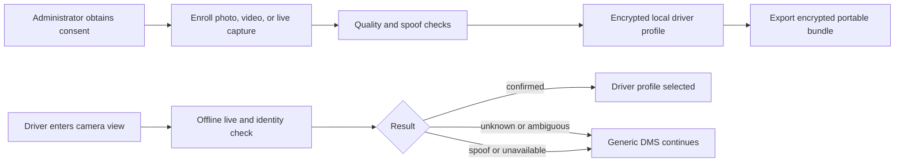
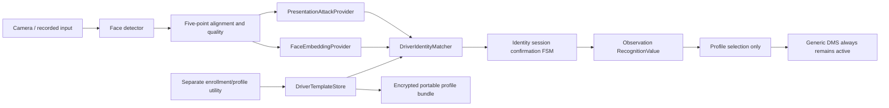
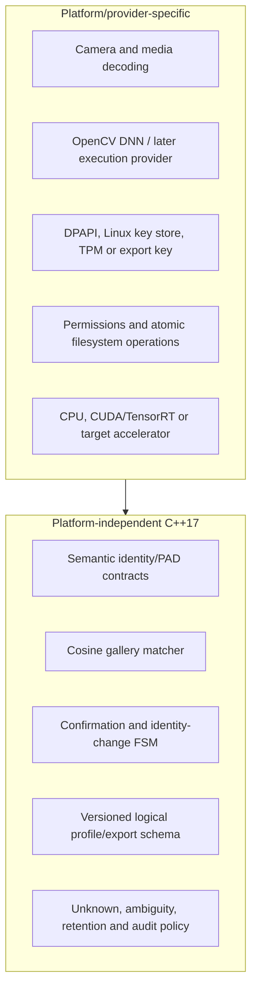

# Stage 21 driver-identification architecture

## User view

## Developer view

The detector/alignment, embedding, PAD, storage, matcher, and temporal session
logic are independently replaceable and independently measurable. Only the
provider layer understands model-specific preprocessing or output topology.

## Platform independence boundary

## Initial technology register

| Block | Technology/version | License/source | Status |
|---|---|---|---|
| Application | C++17 and CMake | Project license | Retained |
| Image/inference API | OpenCV 4.8.0 Windows/Orin; Ubuntu 4.6.0 baseline | Apache-2.0, https://opencv.org | Retained |
| Face detector | Existing YuNet `2026may` asset | Existing checksum/provenance contract | Baseline only |
| Recognition candidate | OpenCV Zoo SFace `2021dec` ONNX | Directory states Apache-2.0; weight/training provenance remains a release blocker | Evaluation only |
| PAD candidate | Open Model Zoo `anti-spoof-mn3`, MobileNetV3, 128x128 | Original model stated MIT; trained on CelebA-Spoof | Evaluation candidate |
| Excluded recognition pack | InsightFace public model packs | Non-commercial research only | Not packaged or selected |
| Profile cryptography | Provider interface; primitive/key choice deferred | Must use reviewed platform crypto | Design only |

The model register records exact hashes after acquisition. A source-code license
does not by itself establish rights to redistribute weights or their training
data derivatives.
